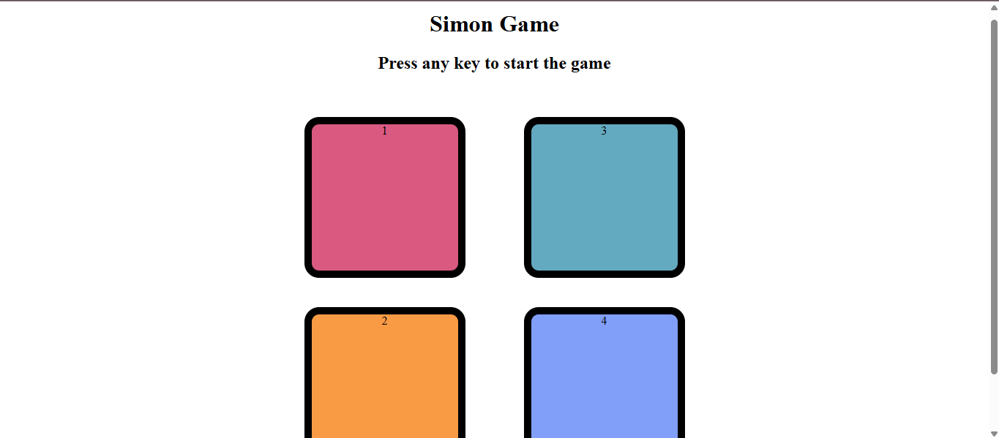

# Simon Game

This is a simple Simon Game made using HTML, CSS, and JavaScript.

## Features
- Interactive color buttons
- Memory-based gameplay
- Sound effects

## How to Play
- Click the buttons in the same order as the game shows.
- The sequence gets longer each level.

## Live Demo
[Click here to play the game](https://moinkhan.github.io)

## Technologies Used
- HTML
- CSS
- JavaScript

## Preview

